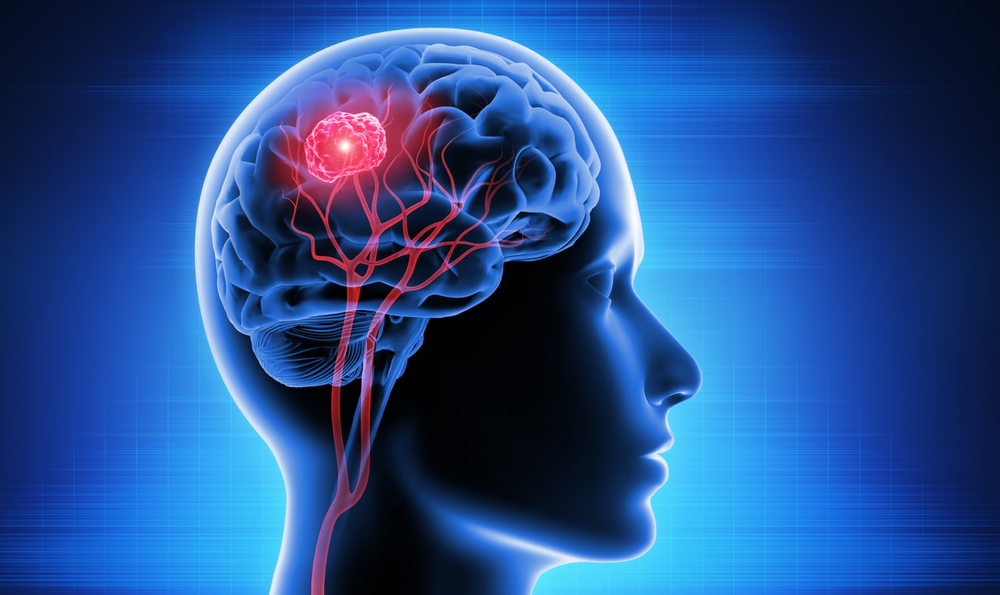

# Data Scientist

#### Technical Skills: Python, MATLAB, R, Machine Learning 

## Projects 

#### [Brain Tumors Detection Using Convolutional Neural Networks](https://github.com/anushkarao5/BrainTumorDetectionCNN)
- Developed a simple CNN with a minimum of 86.5% recall in all tumor classes and an average recall of 93.8% in the tumor classes
- Applied transfer learning to EfficientNetB0 model to achieve over 95% recall in all tumor classes and 95.7% average recall in the tumor classes

  

#### [Superconductor Regression Analysis](https://github.com/anushkarao5/SuperconductorRegressionAnalysis?tab=readme-ov-file)
- Developed a Random Forest model that predicted the critical temperature of a superconductor with root mean square error of 9.41 and R^2 value of 0.92
- Found a subset of 13 of 81 features whose variance explained a minimum of 65% of the variability in the target variable for all non tree-based models
- Found a subset of 25 of 81 features whose variance explained a minimum of 65% of the variability in the target variable for all non-neural network models

#### [US Airlines Twitter Sentiment Analysis](https://github.com/anushkarao5/USAirlinesSentimentAnalysis?tab=readme-ov-file)

- Developed a logistic regression classifier using bag of words text vectorization that resulted in an average minority class recall of 73% and overall accuracy of 77%
- Developed a convolutional neural network using pre-trained GloVe word embeddings that resulted in an average minority recall of 68.3%
- Developed an LSTM neural network using pre-trained GloVe word embeddings that resulted in an average minority recall of 67.5%

