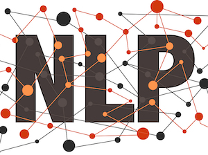

# Data Science Student

  Email: [arrrao@ucdavis.edu](mailto:arrrao@ucdavis.edu)  
  LinkedIn: [anushkarao5](https://www.linkedin.com/in/anushkarao5/)

### Skills:
- Domains: Data Processing, Machine Learning, Deep Learning, Generative AI, Computer Vision, NLP
- Languages: Python, SQL, R
- Software: AWS, Kubernetes, Docker, Git, PostgreSQL, MySQL, Microsoft Office
- Libraries: Pandas, NumPy, Matplotlib, Scikit-Learn, TensorFlow, Keras, OpenCV, Dplyr, Ggplot2

## Projects 

#### [Brain Tumors Detection Using Convolutional Neural Networks](https://github.com/anushkarao5/BrainTumorDetectionCNN)
- Engineered a three-layered CNN classifier model, trained on a dataset of 5700 human brain MRIs, to detect 3 brain tumor types with 94% average recall. This model-based categorization can expedite diagnostic decision-making for healthcare professionals. 
- Improved model performance by implementing pre-trained ResNet50 and EfficientNetB0 models, achieving 95% and 96% average recalls, respectively.
- Applied transfer learning to EfficientNetB0 model to achieve over 95% recall in all tumor classes and an average tumor recall of 95.7% 

  

  <a href="https://awaregleneaglesglobalhospitallbnagar.com/health-plus-blog/what-are-the-common-sign-and-symptoms-of-a-brain-tumour/">Image Credits</a>

#### [Superconductor Regression Analysis](https://github.com/anushkarao5/SuperconductorRegressionAnalysis?tab=readme-ov-file)
- Developed a random forest (RF) model that predicts superconductor critical temperatures, at which a material achieves zero electrical resistance, based on 80 material properties. This model explains 92% of the variability in the critical temperature.
- Leveraged random forest and XGBoost feature importance scores to identify a subset of 13 of 81 features whose variance explained a minimum of 65% of the variance in critical temperatures for all non-tree based models

  

  <a href="https://futurism.com/claim-room-temperature-superconductor-tearing-apart">Image Credits</a>

#### [US Airlines Twitter Sentiment Analysis](https://github.com/anushkarao5/USAirlinesSentimentAnalysis?tab=readme-ov-file)

- Implemented logistic regression with count vectorization to achieve an overall accuracy of 77% in sentiment classification 
- Prioritized increased recall in minority sentiment classes (positive and neutral), resulting in an average minority class recall of 73%
- Developed a convolutional neural network using pre-trained GloVe word embeddings that resulted in an average minority class recall of 68.3%

  

  <a href="https://www.dataversity.net/what-is-natural-language-processing-nlp/">Image Credits</a>

